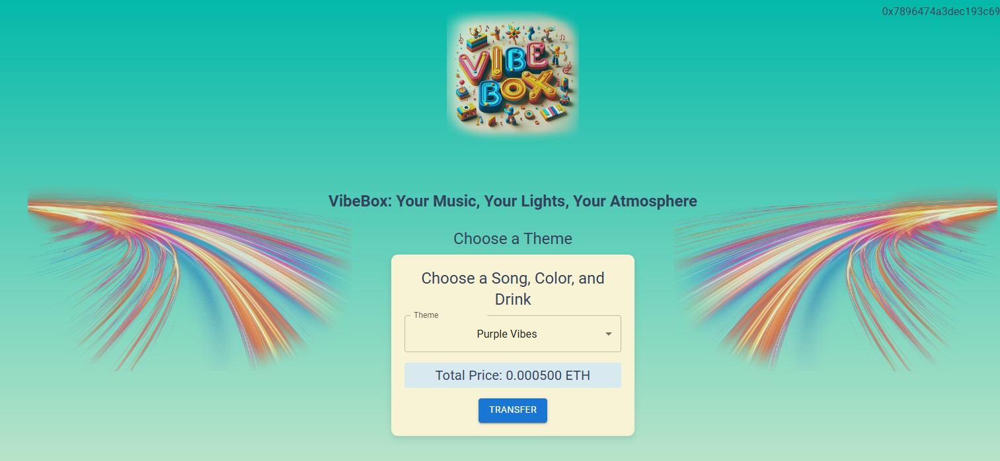

# VibeBox 🎶✨ 

**VibeBox** is an interactive ambient jukebox that puts the power of atmosphere right in the hands of users. With VibeBox, users can control not only the music but also the lighting and decor of a space, crafting a fully immersive experience that suits any mood or style.

## 🌐 How VibeBox Works

1. **Exclusive NFC Clothing 🧢**  
   Users gain access to VibeBox by purchasing limited-edition clothing embedded with NFC chips. Simply tapping a phone to the NFC chip directs them to a secure online portal where they can access VibeBox’s interactive controls.

2. **Crypto Payments 💸**  
   Through the portal, users make a vendor-specified payment in cryptocurrency, equivalent to a USD amount, using wallets like MetaMask. Our blockchain-based smart contract verifies each payment on-chain for a secure, decentralized experience.

3. **Chainlink API Call 🔗**  
   Upon verification of payment, our smart contract triggers an API request using Chainlink. Chainlink locates our backend server’s public IP and securely transmits the user’s request data for processing.

4. **Backend Device Control 🎛️**  
   Our backend server, connected via WiFi to smart plugs and a Bluetooth speaker, activates the preset lighting and music based on user selections. We customized the firmware of the smart plugs to handle these controls seamlessly.

5. **User-Customized Atmosphere 🎶🌈**  
   Users can tailor the ambiance to their preferences—choosing songs, adjusting lighting, and setting decor elements to match their vibe, creating a personalized experience in any physical space.

### 🎉 Applications

**VibeBox** is perfect for enhancing the ambiance in:
- Bars and nightclubs
- Retail stores and showrooms
- Lounges, pop-up events, and more

With VibeBox, transform any environment into an interactive, user-driven experience!

## Key Technologies
- **Chainlink Functions**: Employed to trigger API calls upon transaction confirmation, allowing for secure and reliable connectivity between the blockchain and real-world events.
- **Base Sepolia Test Network**: Used for handling crypto payments, ensuring that all transactions are seamlessly conducted on-chain.

---

## Table of Contents
1. [Getting Started](#getting-started)
2. [Project Overview](#project-overview)
   - [Smart Contract with Chainlink Functions](#smart-contract-with-chainlink-functions)
   - [Frontend Setup and Usage](#frontend-setup-and-usage)
   - [Backend Setup and Usage](#backend-setup-and-usage)
3. [Video Demostration](#🎥-video-demonstration)

---

## Getting Started

To set up and run the application locally, follow these steps for each component. This guide will also help you configure the necessary parameters for full functionality.

### Prerequisites
- Node.js
- Python and Flask
- MetaMask wallet or other Web3 wallet
- Connection to Base Sepolia Test Network

---

## Project Overview

### Smart Contract with Chainlink Functions

The core functionality of the Decentralized Club Controller resides in the smart contract [`APICall_Chainlink.sol`](contract/APICall_Chainlink.sol), which uses Chainlink Functions to communicate with the backend API responsible for the club’s music and light settings. The contract is designed to:
1. **Validate Transactions**: Confirm user payments through the Base Sepolia network.
2. **Trigger API Calls**: Upon successful payment, it sends a request to the backend API to adjust the club’s environment as per the user’s request.

#### Configuration
To deploy the smart contract and enable Chainlink Functions:
1. Deploy the contract to the Base Sepolia test network.
2. Update the following variables to suit your configuration:
   - `donID`
   - `subscriptionID`
   - `router`
   - `recepient`
3. Link the deployed contract to the Chainlink Functions subscription to utilize Chainlink’s oracle network.

---

### Frontend Setup and Usage

The frontend interface, built using React, allows users to connect their Web3 wallet, select themes, and initiate payments for lighting and music control.

#### Configuration
To set up and customize the frontend:
1. Change the `contractaddress` and `abi.json` variables in the frontend to match the deployed contract address and ABI from the smart contract setup.
2. Start the frontend application with the following command:

   ```bash
   npm install
   npm start

> - Frontend interface after successful deployment  


---

### Backend Setup and Usage

The backend API, located in the `backend` folder, is built using Flask. It listens for API requests from the smart contract and interfaces with the club’s hardware to manage the lighting and music.

#### Configuration
To set up and run the backend:
1. Change the `external_url` variable in `app.py` to the public-facing URL of the server.
2. Ensure an audio output Bluetooth device is connected to the system.
3. Start the backend API with:

   ```bash
   pip install -r requirements.txt
   python app.py

## 🎥 Video Demonstration

For a detailed walkthrough of the VibeBox application and its features, check out the video demonstration here: [Watch the Video](https://www.youtube.com/playlist?list=PLUwddwXeIR_8bErGlj_DRcd5fhR_3idPL) 

In this video, you'll see how VibeBox integrates music and lighting controls seamlessly, showcasing the user experience and the underlying technology that powers this innovative application.


